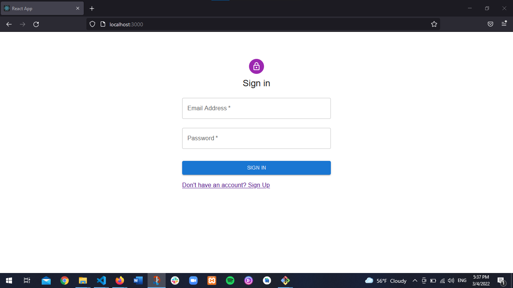
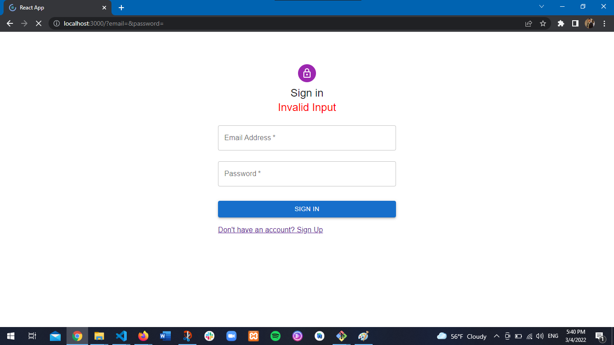
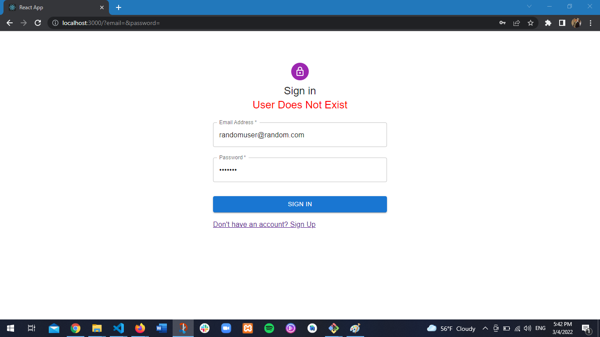
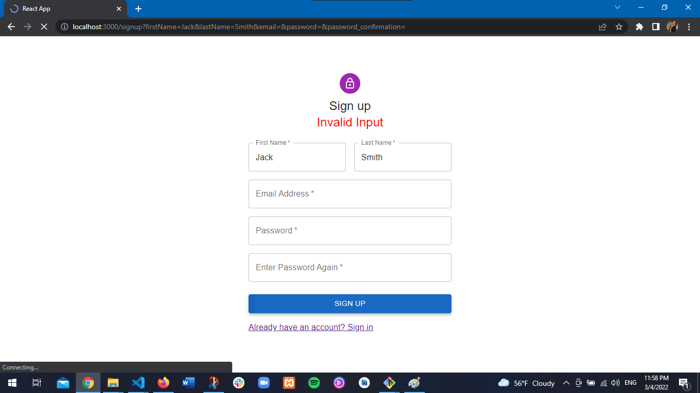
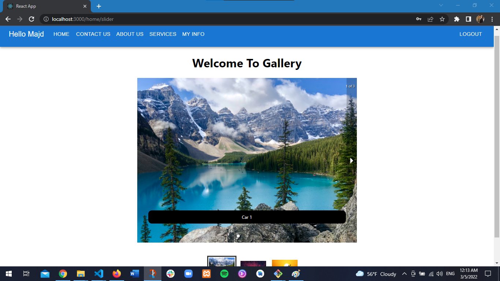
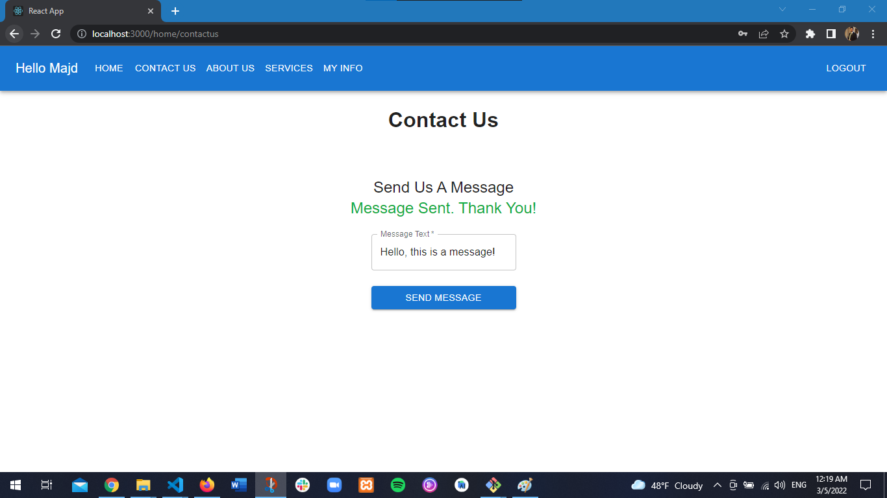
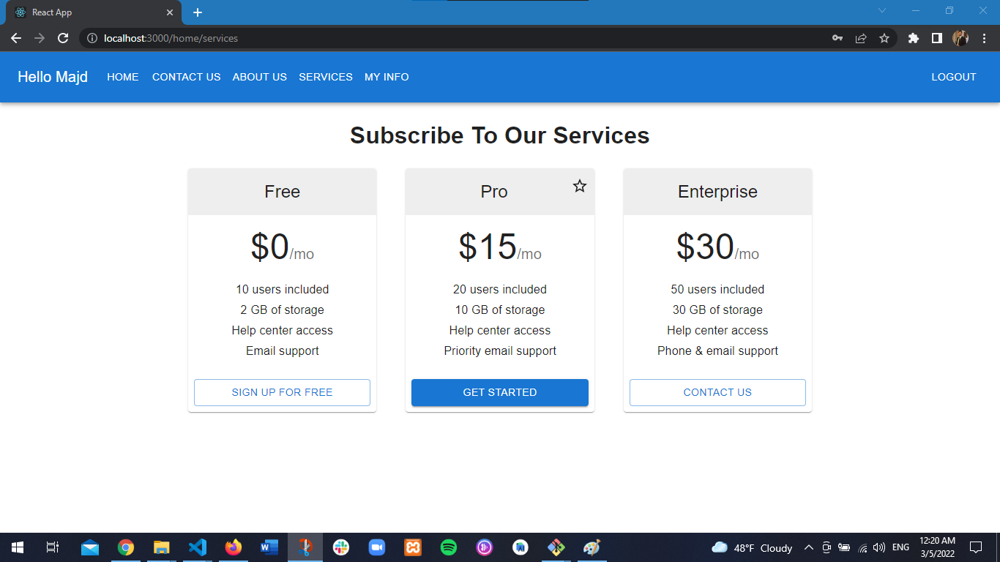

# Sign In Sign Up Project: My First React App

A full stack web project where the user can sign up, sign in with a generated JWT token, and send a message. 
For the front end, React JS is used where as for the back end Laravel 8 is used. 
You can find the back end repository here: https://github.com/MajdHarbb/Laravel-JWT.git 

## Project Demo

### Sign In Page

Type `npm start` in your terminal to run the project and you will have this page: 

The user sign in if they already have an account or they can click "Don't have an account? Sign Up" and go to the sign up page.

If the user leaves an empty field this message wil be displayed: 

If the user is not registered this message will be displayed: 

### Sign Up Page

The user sign up if they don't have an account or they can click "Already have an account?  Sign in" and go to the sign in page.

If the user tries to sign up with invalid input, invalid input means: 
* Empty fields
* Email not in the form: example@example.com
* Passwords doesn't match
The following message will be displayed: 

If the user enters valid input, they will be redirected back to the sign in page. 
When the sign in in successful the user will be redircted to the home page which you can find below.

### Home Page

The home page section contains a navbar with links to navigate and a carousel that displays three pictures. 

#### Contact Us 

Contact us allows the user to send a message. 

#### Serives

Our Services 

#### User Info

The user update their info.

[!alt text](Assets/update.png)

### End